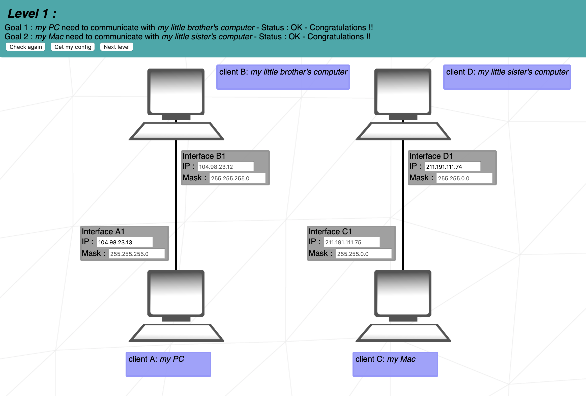
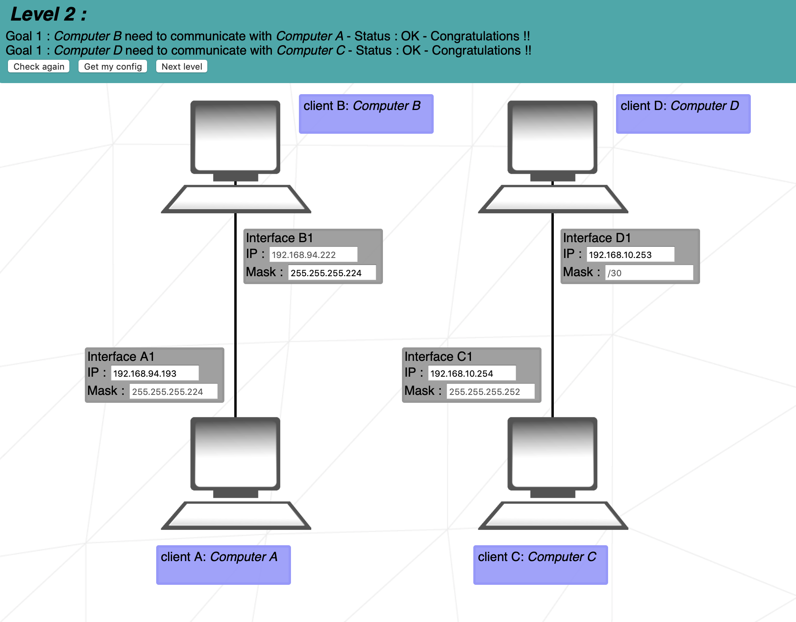
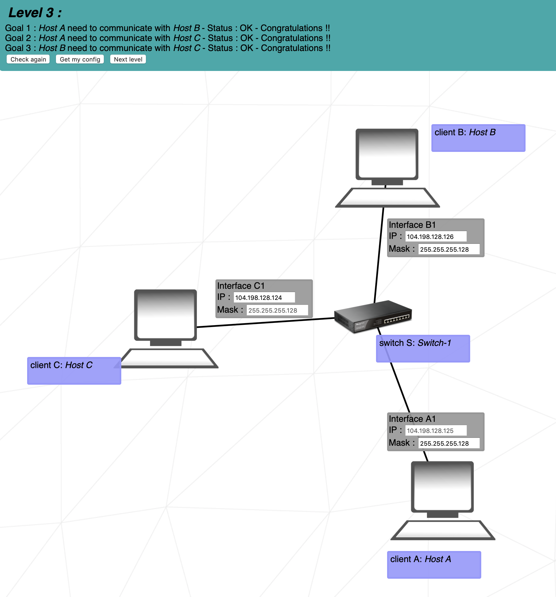
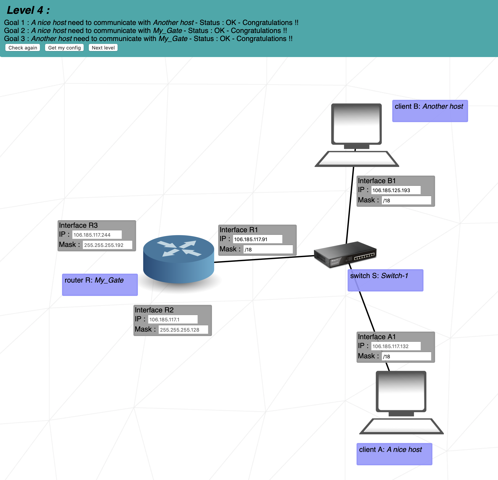
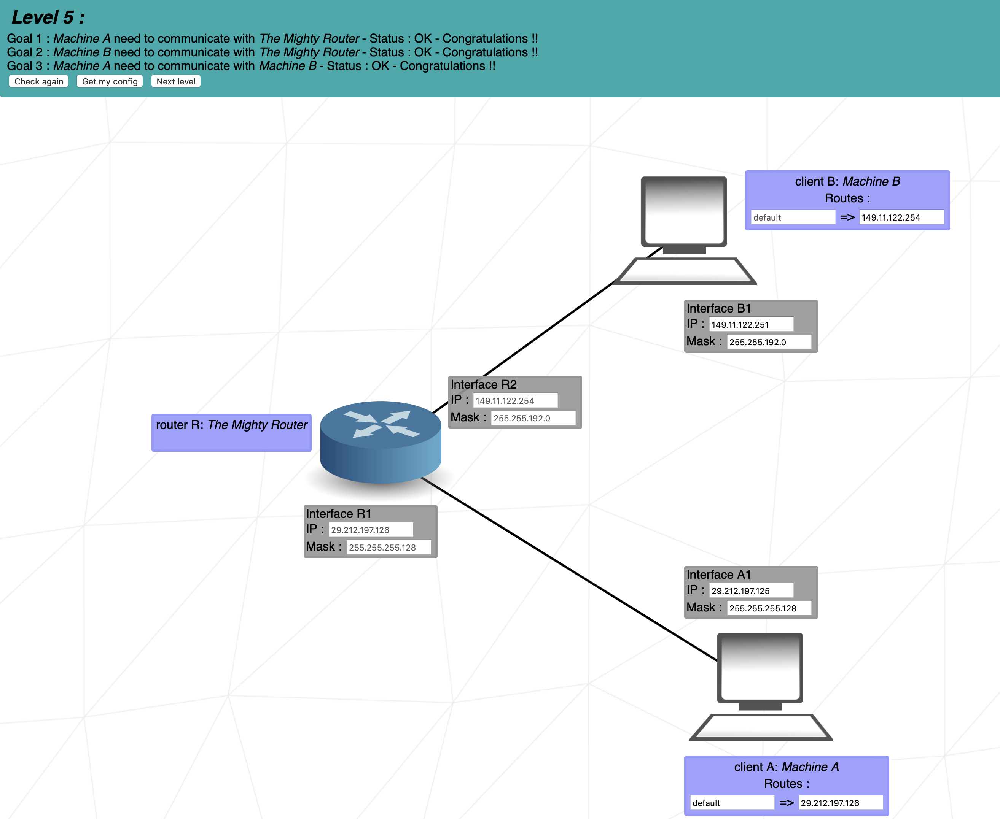
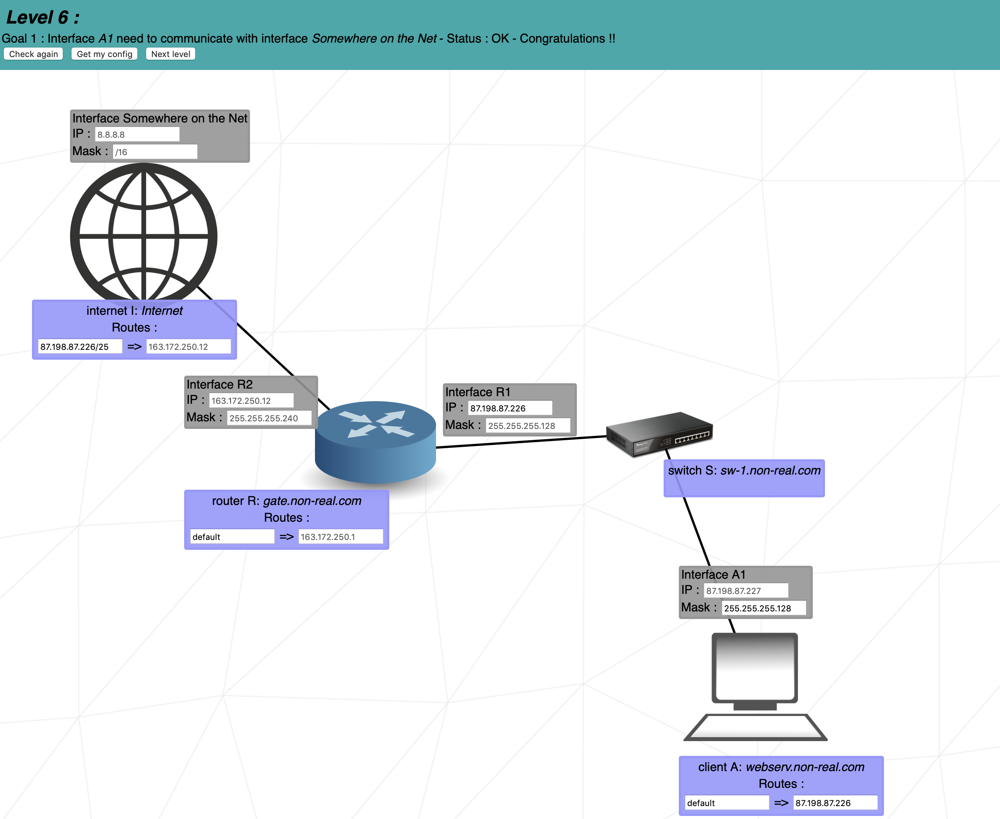
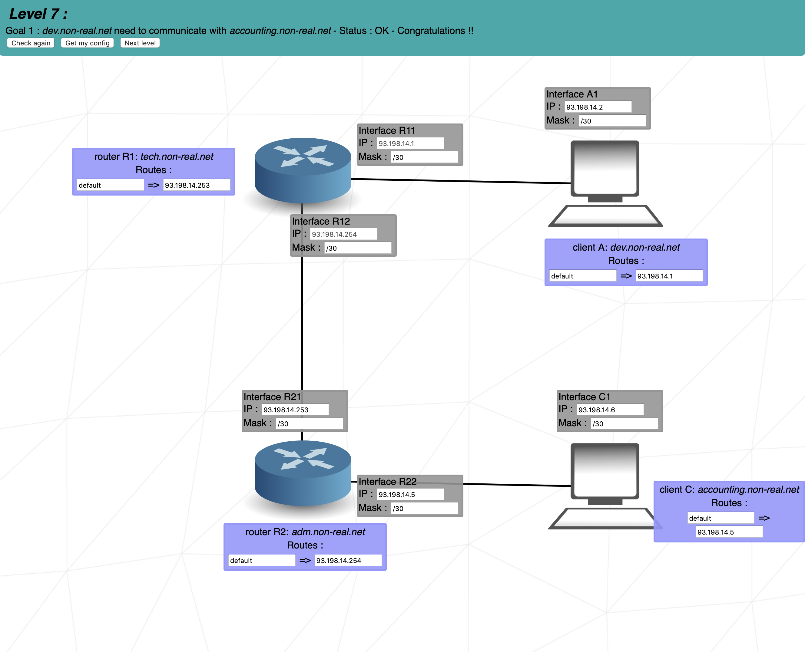
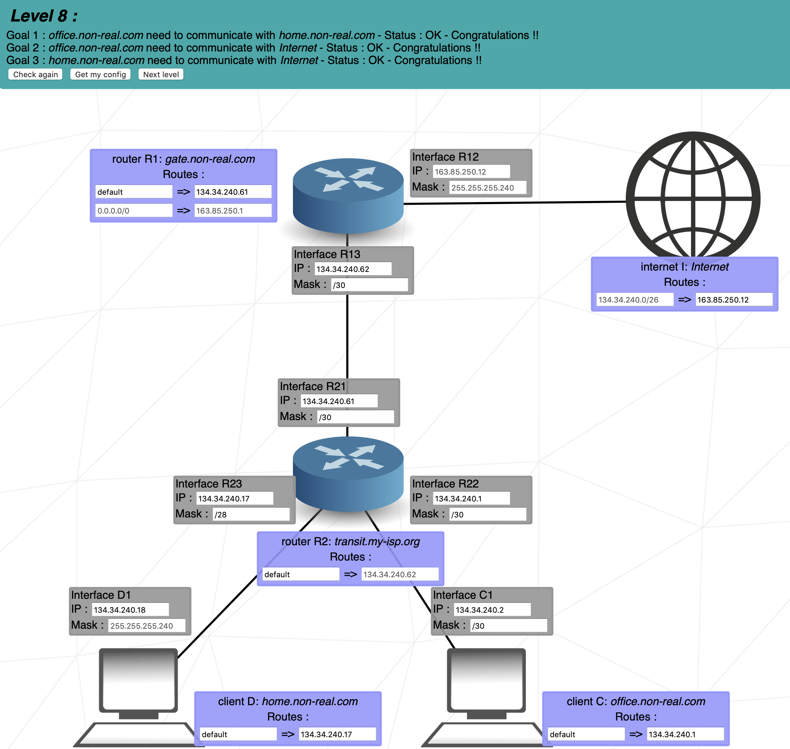
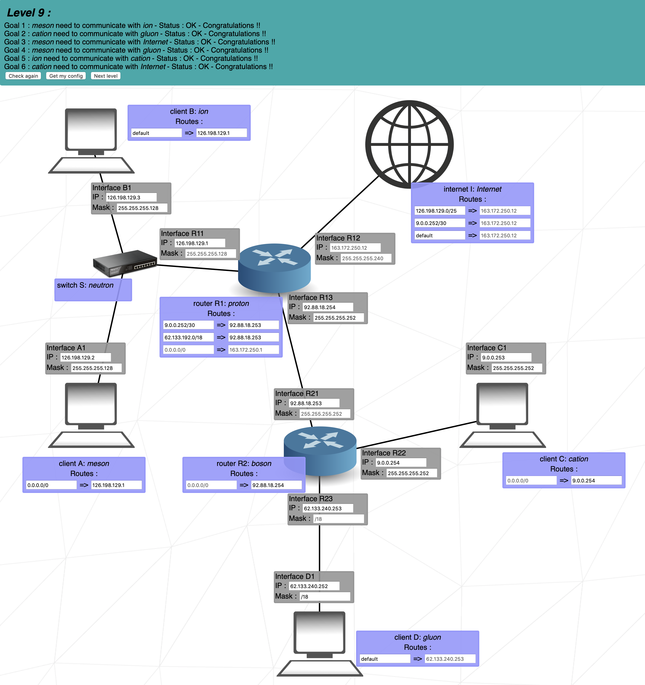
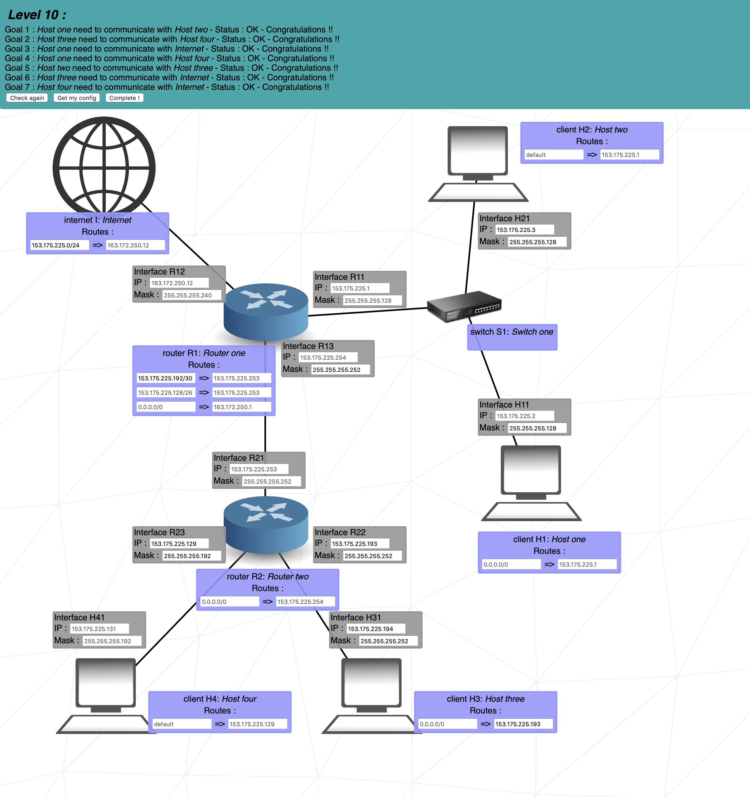

# <h1 align="center">📋 NetPractice 📃</h1>

  
  

This project aims to make you discover the network through practical cases.

 - ✍🏻 Created by Mathis Martini. 
 - 📫 How to reach me: **contact@mathis-martini.fr**.
 - 📫 How to reach me in 42: **mathmart@student.42lyon.fr**.
 - 👨🏻‍💻 Login 42Intra: **mathmart**

<h2 align="left">🔑 Exercices</h2>

To practice this project you need to launch the file [index.html](./Exercices/index.html) located in the folder [Exercices](./Exercices).

<h2 align="left">📋 Summary</h2>

 - [To see the demonstration of all levels](#summary)
    - [Level 1](#1)
    - [Level 2](#2)
    - [Level 3](#3)
    - [Level 4](#4)
    - [Level 5](#5)
    - [Level 6](#6)
    - [Level 7](#7)
    - [Level 8](#8)
    - [Level 9](#9)
    - [Level 10](#10)

<h2 id="summary" align="left"> 📷 Demonstration of levels:</h2>

 Level 1 consists in making two computers communicate with each other following a fixed IP and a fixed mask.

  
  
  

 Level 2 consists in making two computers communicate with each other following a fixed IP and a fixed mask
it is similar in all points to level 1.

Level 3 consists in making computers communicate between them via a switch.

Level 4 consists in making interfaces communicate between them via a switch and a router.

Level 5 consists in making two interfaces communicate with each other via a router.

The level 6 adds an additional difficulty it consists in making communicate an interface via a
  switch which itself redirects towards a router connected to Internet.

Level 7 is rather simple compared to level 6 which must transmit over the internet 
level 7 must simply make two user interfaces communicate via two routers.

At level 8, we need to ensure that the two clients 
  communicate with each other, but also that they have access to the Internet via routers.

  Level 9 is the most complex and time consuming
  in this level it is necessary to make communicate two interfaces between them via 
  a switch, to make communicate two other interface in itself via a router then to make communicate 
  the router and the switch with another router itself connected to Internet.

The last level is level 10 in this level we reproduce a case similar to level 9.

<h2 align="left">
  🖥️ 42 Mark:
  
</h2>

<h2 align="left">⚖️ Copyright</h2>

  Mathis Martini (mmartini42) © 2021

